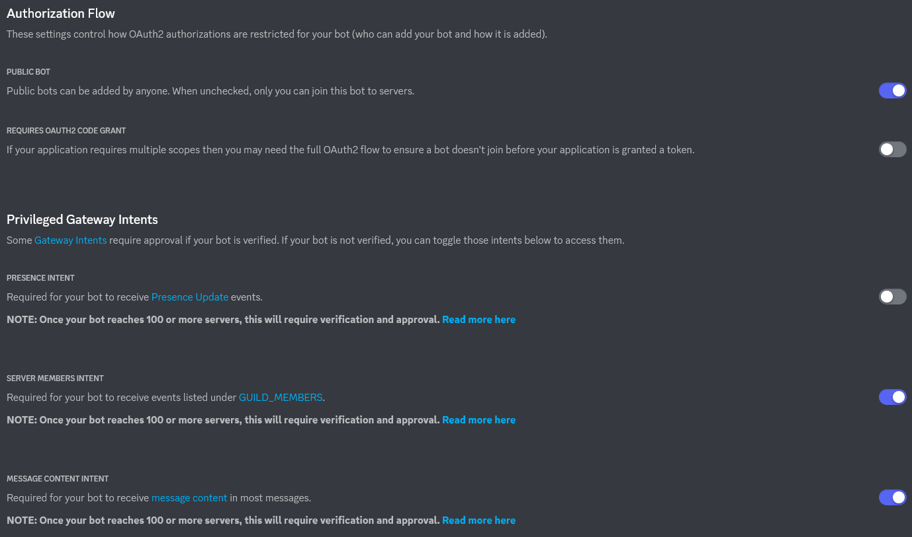
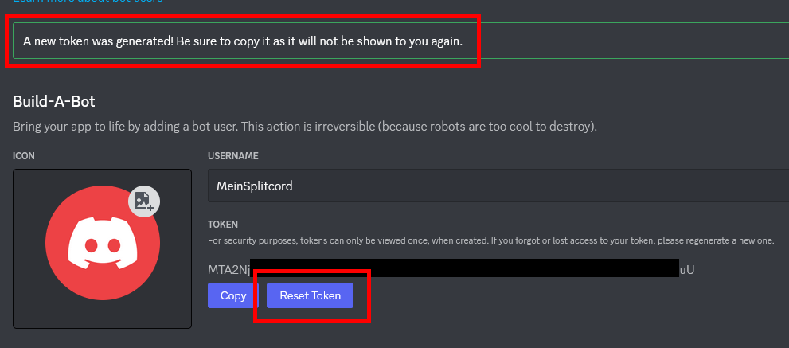

# Initial Dev Setup
This has to be done once, usually.

## Getting Tokens and Stuff
If you already have your `DISCORD_CLIENT_ID` and `DISCORD_TOKEN`, you can skip these steps and go straight to `Add Bot Config`.

### Create an application here: https://discord.com/developers/applications


### Copy the "Application ID". This is your `DISCORD_CLIENT_ID`.


### Add a Bot
1. Go to "Bot" on the left side.
2. Click "Add Bot" and confirm.

### Bot Permissions
Set these permissions:



### Create a Bot Token
Click on "Reset Token" and copy the token that is generated. This is your `DISCORD_TOKEN`.



## Add Bot Config

Once you have your `DISCORD_CLIENT_ID` and `DISCORD_TOKEN`, you can create a new config and fill in these values:
```sh
cp ./config.template.json ./config.json
$EDITOR config.json
```

The config template is pre-filled with valid values for [Coding-Test-Zentrale](https://discord.gg/ekJA6GA3BJ). If you add new config values, also add them in the config template.

> [!TIP]
> As the config.json is actually a `.jsonc` file, it supports comments and trailing commas. If you use VSCode, you can set the syntax mode to `JSONC`.
